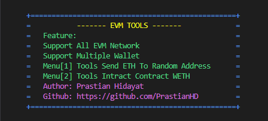

# TOOLS FOR EVM


## Preparation
Make sure you have NodeJS installed. If not, you can install it [install here](https://nodejs.org/en/download/package-manager/current)

## Features
- **Functionality**: Automatic transfer of Native Token to random addresses, interaction to contracts, and creating smart contracts like in RemixIDE.
- **Network Support**: Compatible with all EVM networks, including Testnet and Mainnet. If you want to add an EVM Network, just enter the RPC and CHAIN-ID
- **Wallet Support**: Supports multiple wallets.
- **Tool Menu Options**:
  1. **Menu 1**: Transfer Native Token
  2. **Menu 2**: Interact With Contract
  3. **Menu 3**: Deploy Smart Contract

## Installation
### Clone Repository
First, clone the repository:
```
git clone https://github.com/PrastianHD/evm-tools.git
cd evm-tools
```

### Install Dependencies
Next, install the required dependencies:
```
npm install
```

### Private Key Configuration
Create a .env file in the project root directory:
```
PRIVATE_KEY=["your_private_key", "your_private_key"]
```
Replace `"your_private_key"` with your actual private key.

### Running the Script
```
npm start
```

### Give Start
- Donation : `0x000000DE3b4CD31742711440C1283b162035E00E`
- Don't Forget to Click `STAR` on this reposity
- Don't Forget to `FORK` this Reposity
